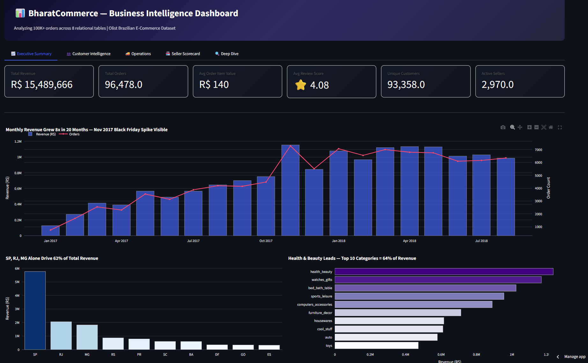
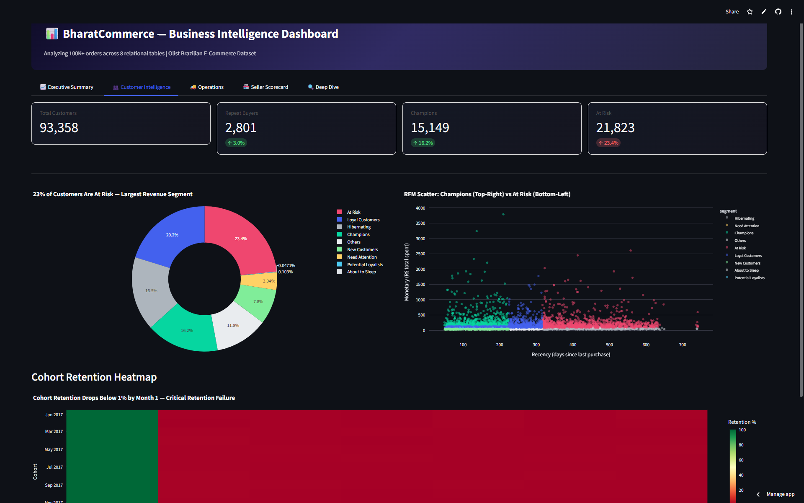
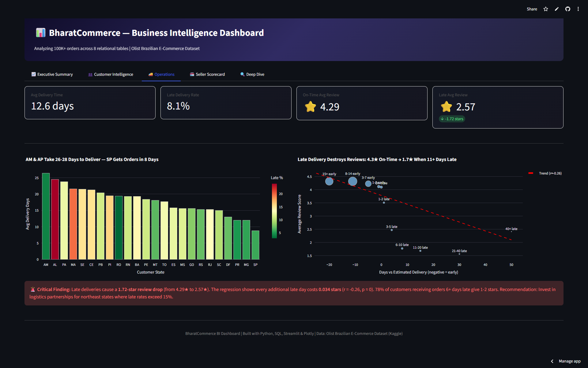
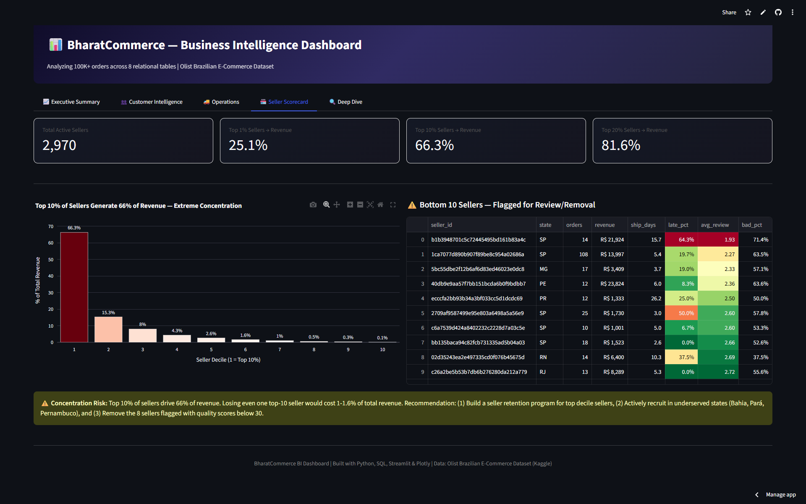

# 📊 BharatCommerce — E-Commerce Business Intelligence Dashboard

**Analyzing 100K+ orders to answer the 10 questions every VP of Operations would ask.**

🔗 **[Live Dashboard](https://bharatcommerce.streamlit.app)** · Built with Python · SQL · Streamlit · Plotly



---

## Business Problem

An e-commerce platform is growing fast but flying blind — no visibility into customer retention, delivery failures, seller quality, or revenue concentration. Leadership needs a single dashboard that turns 100K+ orders across 8 relational tables into actionable decisions.

BharatCommerce answers 10 business questions using advanced SQL (CTEs, window functions, cohort analysis) and presents them in an interactive 5-tab Streamlit dashboard.

---

## Key Findings

| # | Insight | Impact |
|---|---------|--------|
| 1 | **Only 3% of customers make a repeat purchase** — 97% are one-and-done buyers | Retention, not acquisition, is the #1 priority |
| 2 | **Late deliveries cause a 2.02-star review drop** (4.29★ on-time → 2.27★ late) | Every late day costs 0.034 stars; 78% of 6+ day late orders get 1-2 stars |
| 3 | **Top 10% of sellers generate 66% of revenue** | Losing one top seller = 1-1.6% revenue hit; extreme concentration risk |
| 4 | **23% of customers are "At Risk"** — they drove 34% of revenue but haven't returned | Largest RFM segment by revenue, highest churn probability |
| 5 | **3 states (SP, RJ, MG) drive 62% of revenue** while Pará has 922 customers per seller | Northeast states are underserved — seller recruitment opportunity |

---

## Tech Stack

| Layer | Technology |
|-------|-----------|
| Database | SQLite (transferable SQL — CTEs, window functions, joins) |
| Language | Python 3.10+ |
| EDA | Pandas, Matplotlib, Seaborn |
| Dashboard | Streamlit, Plotly |
| Statistics | SciPy (Pearson correlation, linear regression) |
| Deployment | Streamlit Cloud |

---

## Dashboard — 5 Tabs

### Tab 1: Executive Summary
KPI cards (revenue, orders, AOV, reviews) → monthly revenue trend with dual-axis chart → revenue by state and product category → business recommendation.

### Tab 2: Customer Intelligence
RFM segmentation (Recency, Frequency, Monetary) with donut chart and scatter plot → cohort retention heatmap showing sub-1% retention by Month 1 → repeat purchase analysis.

### Tab 3: Operations
Delivery time by state (8 days in SP vs 26 in AM) → late delivery rate heatmap → scatter plot with regression line quantifying the review-delivery relationship → correlation statistics (r = -0.26, p ≈ 0).

### Tab 4: Seller Scorecard
Revenue concentration Pareto chart (top decile = 66%) → bottom 10 sellers flagged for removal with color-coded quality metrics → composite quality scoring.

### Tab 5: Deep Dive
Interactive filters (state, category, date range) → dynamic charts → raw data table with CSV download.

---

## SQL Queries — 10 Business Questions

All queries are in [`/sql/queries/`](sql/queries/) — each demonstrates advanced SQL concepts asked in Data Analyst interviews.

| Query | Business Question | SQL Concepts |
|-------|------------------|-------------|
| [01_revenue_trend.sql](sql/queries/01_revenue_trend.sql) | Monthly revenue trend & seasonality | CTE, LAG() window function |
| [02_rfm_segmentation.sql](sql/queries/02_rfm_segmentation.sql) | Customer segmentation (RFM) | NTILE(), chained CTEs, CASE WHEN |
| [03_product_performance.sql](sql/queries/03_product_performance.sql) | Category rankings & Pareto analysis | RANK(), DENSE_RANK(), cumulative SUM |
| [04_delivery_performance.sql](sql/queries/04_delivery_performance.sql) | Delivery time & late rates by state | Date arithmetic, conditional aggregation |
| [05_seller_quality.sql](sql/queries/05_seller_quality.sql) | Seller scorecard & bottom performers | ROW_NUMBER(), composite scoring, 5 CTEs |
| [06_geographic_analysis.sql](sql/queries/06_geographic_analysis.sql) | Market tiers & growth opportunities | SUM() OVER(), scalar subqueries |
| [07_payment_analysis.sql](sql/queries/07_payment_analysis.sql) | Payment methods & installment impact | Pivot-style CASE WHEN, bucketing |
| [08_customer_retention.sql](sql/queries/08_customer_retention.sql) | Cohort retention matrix | MIN() OVER(), LEAD(), ROW_NUMBER() |
| [09_revenue_concentration.sql](sql/queries/09_revenue_concentration.sql) | Revenue concentration risk (Pareto) | Cumulative distribution, PERCENT_RANK() |
| [10_delivery_vs_reviews.sql](sql/queries/10_delivery_vs_reviews.sql) | Delivery impact on reviews (quantified) | Bucketed aggregation, correlation prep |

---

## Data Source

**Olist Brazilian E-Commerce Dataset** (Kaggle)
- 100K+ orders | 93K+ customers | 3K sellers | 33K products
- 8 relational tables spanning Sep 2016 – Aug 2018
- [Dataset Link](https://www.kaggle.com/datasets/olistbr/brazilian-ecommerce)

---

## Project Structure

```
bharatcommerce/
├── data/
│   ├── raw/                  # Kaggle CSVs (gitignored)
│   └── bharatcommerce.db     # SQLite database (auto-built)
├── sql/
│   ├── schema.sql            # Table definitions with relationships
│   └── queries/              # 10 business question SQL files
├── src/
│   ├── setup_db.py           # Builds SQLite DB from CSVs
│   ├── run_query.py          # CLI tool to run any .sql file
│   └── app.py                # Streamlit dashboard (5 tabs)
├── .streamlit/config.toml    # Dark theme config
├── requirements.txt
└── README.md
```

---

## How to Run Locally

```bash
# 1. Clone and setup
git clone https://github.com/errorboy4O4/bharatcommerce.git
cd bharatcommerce
python -m venv venv && venv\Scripts\activate  # Windows
pip install -r requirements.txt

# 2. Download dataset from Kaggle and extract CSVs to data/raw/
# https://www.kaggle.com/datasets/olistbr/brazilian-ecommerce

# 3. Build the database
python src/setup_db.py

# 4. Run the dashboard
streamlit run src/app.py
```

---

## Screenshots

<table>
<tr>
<td></td>
<td></td>
</tr>
<tr>
<td></td>
<td></td>
</tr>
</table>

---

## Author

**Kaushik Gaur** · [LinkedIn](https://www.linkedin.com/in/kaushik-gaur-007aab242/) · [GitHub](https://github.com/errorboy4O4)

---

*Part of a 3-project portfolio: [CricIQ](https://github.com/errorboy4O4/criciq) (ML + LLM) · [IndiaMandi](https://github.com/errorboy4O4/indiamandi) (RAG + AI) · **BharatCommerce** (SQL + BI)*
